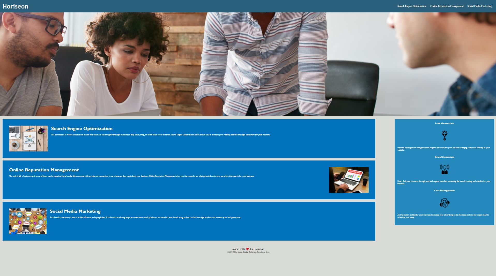

# Challenge1htmlcss

#Description:

#Given the task to refactor an existing html code to help meet accessibily standards, and fix broken code, and make the code less redundant. 

#Updated and Accomplished: 
Alt image tags were added, as well as semantic tags to aid in accessibility. 

#Website:

 

#Link 
[Challenge1htmlcss](https://github.com/krystalnickole1212/Challenge1htmlcss.git)